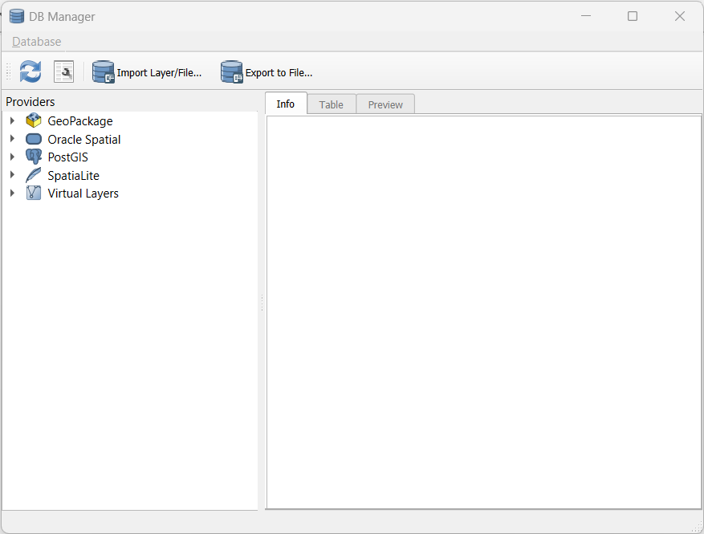

# Creating a Database

## Start QGIS
Open QGIS. Start a new project by either clicking on the white rectangle icon (with the corner turned down) or selecting "new" under the Project menu. You now should have a blank map canvas ready to go.

## Starting the DB Manager Plugin
We'll be using the DB Manager plugin, so let's make sure that is installed:

1. Click the Database menu at the top of the QGIS window.  Do you have the DB Manager listed as an option in this menu?  If so, click the icon to open the tool and skip Step 2 below.  If not, move on to Step 2 below.
1. If the DB Manager is not in the Database menu, we need to enable the plug in:  

    i. Click the Plugins menu at the top of the window and select "Manage and install plugins".  This will open the Plugins Manager.  
    ii. Make sure you're in the "All" tab on the left side of the tool, and then in the search box, start typing "DB Manager" to narrow down the options.  
    iii. Select "DB Manager" from the list to view the details about this plugin.  
    iv. Click the *Install Plugin* button in the lower right corner to install it.  If this option isn't available, the tool is probably already installed and you just need to make sure the box next to the tool in the list is checked so that is available.  Now go back to Step 1 above to start the tool.
	

## Make a Database
You can think of a database as a folder in which you keep tables that are related to each other.  You don't want to put data in this database that isn't related to the other data (you could, but that's not the point of a database).

We'll need to make a new database to keep our spatial tables in:

1. Locate your Browser Panel. By default, it usually sits above or below the Layers Panel on the left side of the Map Canvas.  If you've closed it (like your instructor tends to do), you can get it back with *View* Menu --> *Panels* --> *Browser Panel*
1. Right click on the SpatiaLite item (it has the feather icon)  and select *Create Database*
1. Navigate to where you would like to keep your database, perhaps in the folder where you downloaded the data for this workshop.  Name your database *sfbay.sqlite* because we'll be working with San Francisco Bay data.  Yes, it should be all lowercase.

You may have noticed that there are many database format options available to you besides SpatiaLite.  We're working with a SpatiaLite file today, but you can match your future databases to the needs of your project.  Different database formats have different functions available and can be better for certain types of analysis.  For example, PostGIS is great for geocoding and also for working with very large datasets, among other things.

Let's connect to our database:

1. Open or locate the DB Manager that we found earier.
1. Right click on the *SpatiaLite* option and select *New Connection*.
1. Navigate to where you saved your *sfbay.sqlite* file, slect the file, and click *Open*.
1. Expand the list (click on the > symbol) in the *Providers Panel* on the left to see that your database is now available.
1. If you expand the list next to the *sfbay.sqlite* database, you'll see if has some tables, but none of these contain data yet.  We'll add some data next.
