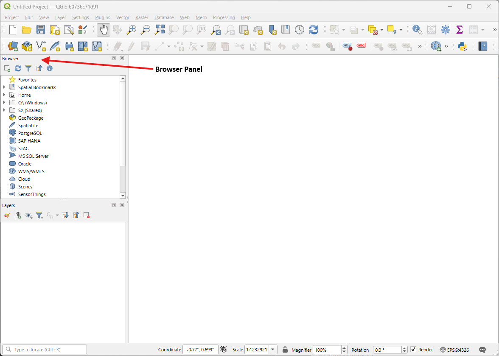

# Creating a Database

## Start QGIS
Open QGIS. Start a new project by either clicking on the white rectangle icon (with the corner turned down) or selecting "new" under the Project menu. You now should have a blank map canvas ready to go.

## Browser Panel
We'll be using the Browser panel that is a standard part of the QGIS interface.  Typically, it is located on the left side of the interface, above the Layers panel.  However, you may have moved it or closed it.  If you do not see the Browser panel, here's how to add it to your screen:

1. Click on the *View* menu.
1. Hover over *Panels*.
1. Check the box next to *Browser*.
	

## Make a Database
You can think of a database as a folder in which you keep tables that are related to each other.  You don't want to put data in this database that isn't related to the other data (you could, but that's not the point of a database).

We'll need to make a new database to keep our spatial tables in:

1. In the Browser Panel, right click on the *SpatiaLite* item (it has the feather icon) and select *Create Database* 
1. Navigate to where you would like to keep your database, perhaps in the folder where you downloaded the data for this workshop.  Name your database *sfbay.sqlite* because we'll be working with San Francisco Bay data.  Yes, it should be all lowercase.
1. You should now see sfbay.sqlite listed in the Browser under your SpatiaLite connections.

You may have noticed that there are many database format options available to you besides SpatiaLite.  We're working with a SpatiaLite file today, but you can match your future databases to the needs of your project.  Different database formats have different functions available and can be better for certain types of analysis.  For example, PostGIS is great for geocoding and also for working with very large datasets, among other things.

## Connect to an Existing Database
What if you already have a SpatiaLite database you wanted to work with? Maybe you made one earlier, or someone sent you a database, and you want to work with it in QGIS.  Right click on the SpatiaLite item in the Browser and choose *New Connection...*. Then navigate to the SpatiaLite file you want to open and click *Open*.
