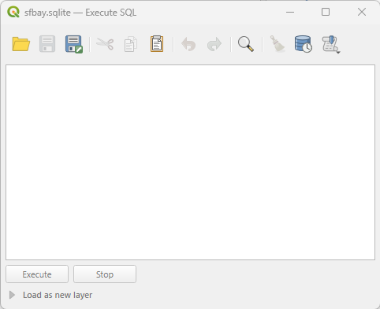

# Execute SQL Tool

Now we're just about ready to do some analysis with our database.  Right click on *sfbay.sqlite* in the *Browser* panel and choose *Execute SQL*.  The *Execute SQL* window should pop up. You may need to expand the window by dragging the lower right corner.

This interface is pretty sparse. A query is a request for information from the database. You will type your queries into the big blank box in the middle of the window.  

You'll run the query by clicking the *Execute* button at the bottom of the window.

The results of the query will appear in in a box below.  Sometimes the results will be a table; sometimes it will be a message.

A query has a structure.  The most common one you'll see today is a "select statement".  These start with the SELECT command, followed by the information you want to know, then the name of the table you want the information from, and finally (and optionally) other parameters that limit the results or provide some important caveats.  Queries end with a semicolon.

In the next section, we'll try some queries!