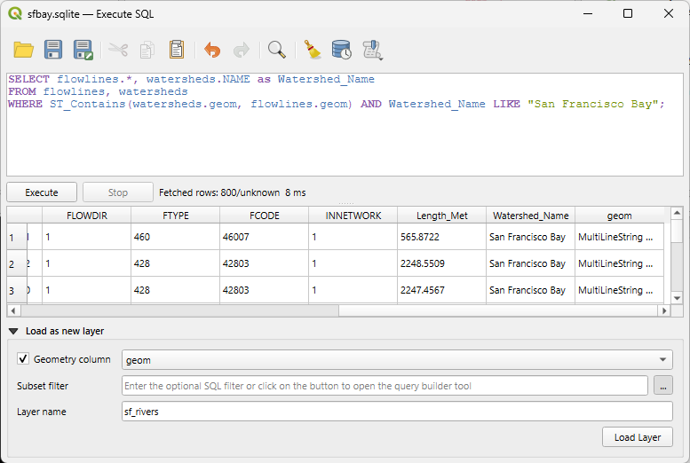
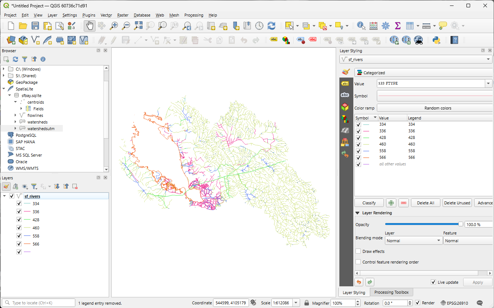

# Viewing a Query to QGIS

You don't have to save a query as a table to view it in QGIS.  Sometimes you just want to see the results, but don't need to keep a table that you might not need later.  

Let's build on the spatial join we just did to just keep the lines in the San Francisco Bay watershed and then add it to the QGIS map canvas. First, we write and execuite the query:

```
SELECT flowlines.*, watersheds.NAME as Watershed_Name
FROM flowlines, watersheds
WHERE ST_Contains(watersheds.geom, flowlines.geom) AND Watershed_Name LIKE "San Francisco Bay";
```

Now we can load it into the map canvas:

1. At the bottom of the *Execute SQL* window, expand the *Load as new layer* menu by clicking on the black triangle.
1. Check the box next to *Geometry column* and make sure the drop down is set to the correct column, *geom*.
1. Leave the subset filter blank (we can write SQL now so we don't need to use this).
1. For the *Layer name*, call it *sf_rivers*. This will be the name of the layer in the *Layers* panel once we load it.
1. Click the *Load Layer* button.
1. You should now have just the flowlines in the San Francisco Bay watershed.



Now you have access to the *Layer Properties* and all the other tools you might use with any other vector layer in QGIS.  For fun, let's style this layer:

1. Open up the *Layer Properties* (*View* menu > *Panels* > check *Layer Styling*).
1. Instead of *Single Symbol*, let's pick *Categorized* from the top drop-down menu.
1. For the *Column*, pick *FTYPE*
1. Click the *Classify* button under the big white box.


